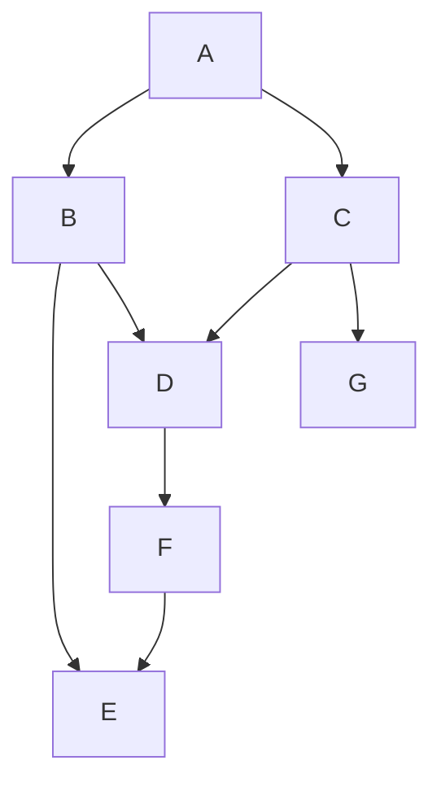

# graph-run

Figure out which items in a dependency graph can be handled in
parallel, and which must be deferred until their dependencies are
completed. Handles cyclic and acyclic graphs, but if cycles are
allowed, then dependency order may not be guaranteed.

For example, given the following directed graph:



it will allow you to operate in this order:

- E and G in parallel (since they are leaf nodes)
- F when E is complete
- D when F is complete
- B when D and E are complete (possibly in parallel with C)
- C when D and G are complete (possibly in parallel with B)
- A when B and C are complete

Operation will be maximally parallelized, so that each step in
the graph only waits until its dependencies are completed.

## Cycles

If a cycle exists in the graph, then at least one node in the
cycle will by necessity be operated upon _before_ its
dependencies are complete.

Cycles may be disallowed by throwing in the `onCycle` method
provided.

## Contract

- Each node reachable from the initial entry points provided will
  be visited exactly once.
- Except in the case of cycles, each node's dependencies will be
  visited before itself.
- In the default async forms of the methods provided:
  - All methods will be awaited before continuing.
  - Any operations that can be done in parallel will be.
- All pending visits and dependency lookups will be skipped if a
  provided `AbortSignal` fires.

## Difference between this and typical topological sort

This is not just a topological sort, and there are better
libraries available that implement Kahn's Topological Sort very
efficiently.

However, topological sorting is insufficient if you wish to know
which items can be operated on _in parallel_, and Kahn's
algorithm only works when the graph is guaranteed to be acyclic
and all nodes are known ahead of time.

This implementation does not require that the graph be entirely
loaded ahead of time, and provides a mechanism to treat cycles as
a warning rather than an error, with the caveat that if cycles
are allowed then topological ordering is of course not
guaranteed.

## Caveat

While this _can_ be used in theory to explore any infinitely large
graph, note that the result set will be stored in memory.

So, if you were to use it to try to crawl all the links in
Wikipedia or something, you're going to have a Bad Time if the
result set gets too big.

## USAGE

```js
import {
  // returns Promise<Map<Node, Result>>
  graphRun,
  // returns Promise<Map<Node, PromiseSettledResult<Result>>>
  // like Promise.allSettled
  // Implies failFast:false
  allSettled,
  // resolves to first successful result, or rejects with AggregateError
  // like Promise.any()
  any,
  // returns or rejects on the first visit to complete
  // like Promise.race()
  race,

  // options provided to sync methods MUST be sychronous

  // returns Map<Node, Result>
  graphRunSync,
  // returns Map<Node, PromiseSettledResult<Result>>
  allSettledSync,
  // returns first successful result, or throws AggregateError
  anySync,
  // returns or throws on the first visit
  // this is somewhat useless, since you can just call the method
  // on the first node in the options.graph list, but is included
  // for symmetry reasons.
  raceSync,
} from 'graph-run'

// optionally used to trigger an abort of the walk at any time
const ac = new AbortController()

// return value will be a Promise<Map<Node, Result>>
// when using allSettled, returns Promise<Map<Node, PromiseSettledResult>>
const results = await graphRun/*<Node, Result>*/({
  // provide one or more node to serve as entry points.
  // this MAY be the entire graph, but doesn't have to be.
  // Node[]
  graph: [some, nodes, known, at, the, start],

  // a sync or async method for providing nodes that are
  // dependents of the node being considered.
  // Return [] if node has no dependencies.
  // (n: Node) => Node[] | Promise<Node[]>
  getDeps: async (n) => {
    // if a promise is returned, then it must resolve to an
    // array of nodes.
    return [the, dependency, node, objects]
  },

  // sync or async method that will be executed on each node in the graph
  // node is the data object being operated on, signal is an
  // AbortSignal that will fire if the operation should halt.
  // (node: Node, signal: AbortSignal, path: Node[]) => Result|Promise<Result>
  visit: async (node, signal, path) => {
    await doSomething(n)
  },

  // optional: if this method throws, then the traversal will
  // of course fail when cycles are encountered. If not provided,
  // then cycles are silently detected and skipped.
  // first argument is the array of nodes forming a cycle,
  // second argument is the path taken to get to the cycle entry
  // (node: Node[], cycle: Node[], path: Node[]) => void | Promise<void>
  onCycle: (node, cycle, path) => {
    console.error(
      `warning: while evaluating ${
        node 
      } at path ${
        path.join('->')
      } encountered cycle: ${
        cycle.join('->')
      }. Proceeding without this dependency.`
    )
  },

  // Whether to abort the entire traversal on the first error
  // if true, then this will reject with an error and trigger an abort
  // on all in-progress operations.
  // if false, then the rejection value will be an AggregateError of all
  // failures encountered. (For consistency, an AggregateError is
  // raised if failFast is false, even if only one failure is countered.)
  // default: true
  failFast: true

  // Optional: pass along a signal that you can use externally to signal
  // the graph traversal should end prematurely.
  signal: ac.signal
})

// Another example, detect whether it's a directed acyclic graph:
const isDAG = (graph) => {
  try {
    graphRunSync({
      graph: [graph],
      getDeps: n => n.children ?? [],
      onCycle: () => { throw 'cycle detected' },
    })
    return true
  } catch {
    return false
  }
}

const g = {
  children: [
    {
      name: 'a',
      children: [{ name: 'b' }],
    }
  ]
}
console.log(isDAG(g)) // true
// create a cycle
g.children[0].children[0].children = g.children
console.log(isDAG(g)) // false
```

See [the typedocs](https://isaacs.github.com/graph-run) for
complete API details.

## Other Options

- [topological-sort](https://www.npmjs.com/package/topological-sort)
- [@hapi/topo](https://www.npmjs.com/package/@hapi/topo)
- [toposort](https://www.npmjs.com/package/toposort)
- [graph-data-structure](https://www.npmjs.com/package/graph-data-structure)
- [js-graph-algorithms](https://www.npmjs.com/package/js-graph-algorithms)
- [fast-graph](https://www.npmjs.com/package/fast-graph)
- [treeverse](https://www.npmjs.com/package/treeverse)

## How This Is Different

- More flexible than most as far as the data structures used. Ie,
  `Node` can be any value type.
- Dependency edges are resolved on-demand, and may be calculated
  asynchronously, making it efficient in cases where loading the
  entire graph may be expensive.
- Both cyclic and acyclic graphs are supported.
